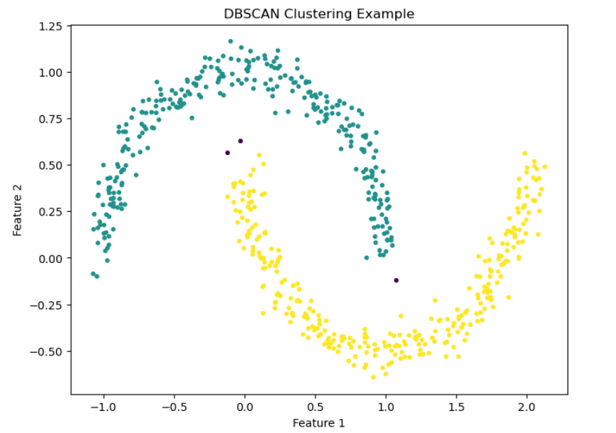

# Data Science

## Index
1. [Introduction](#introduction)
2. [Pandas & NumPy](#pandas)
    - [What is Pandas?](#what-is-pandas)
    - [What is a Dataframe?](#dataframes)
    - [What are Pandas Attributes?](#attributes)
    - [What are Pandas Functions?](#functions)
    - [What are Pandas Methods?](#methods)
    - [NumPy Basics](#numpy)
    - [...](#)
3. [Machine Learning](#machine-learning) (TODO)
    - [Supervised Learning](#supervised-learning)
        - [Regression](#regression)
        - [Classification](#classification)
    - [Unsupervised Learning](#unsupervised-learning)
        - [...]()
    - [Model Evaluation & Performance](#model-evaluation-and-performance)
        - [GridSearch](#grid-search)
        - [RandomizedSearch](#randomized-search)
    - [Natural Language Processing](#nlp) (TODO)
        - [...]()
    - [Large Language Models](#llm) (TODO)
        - [...]()
4. [Interview Questions & Anwers (TODO)](#interview-questions-and-answers)
    - [](#)
    - [](#)
    - [](#)
    - [](#)

## Introduction
This course focuses on Data Science and Analysis using Python.
This course is built upon the following references:
- [FreeCodeCamp: Learn Python for Data Science – Full Course for Beginners ](https://www.freecodecamp.org/news/learn-python-for-data-science-full-course/)
- [Official Python Documentation](https://docs.python.org/3/)
- [Official Pandas Library Documentation](https://pandas.pydata.org/docs/)

## Pandas

### What is Pandas?
Pandas is a Python library used for data analysis, it allows us to clean, wrangle, visualize data.

Pandas compared to excel offers multiple advantages:
- limitation by size: excel can only handle a maximum of 1 million rows.
- complex data transformations: by using code.
- automation: python is designed for automation.
- cross platform capabilities: it's not tied to excel or any other program.

### Dataframes
You can imagine a Pandas DataFrame as an excel spreadsheet. It's a column-based 2d array, where the columns are known as “features” (or “series”) and each row value is known as “observation”.

You can create a DataFrame by using a Python dictionary as follows:
```Python
df = { 'key1': [...], 'key2': [...] }
```
#### Examples

To load a table (list of lists) with first row as headers of the table:
```Python
import pandas as pd

data = [['Brand', 'Price'],['Apple', 1500], ...]
df_laptops = pd.DataFrame(data=data[1:], index=[row[0] for row in data][1:], columns=data[0])
```

Let's have some practical examples:
```Python
import pandas as pd
import numpy as np

# creating an array using numpy
data = np.array([[1,4],[2,5],[3,6]])
# creating a dataframe with pandas
pd.DataFrame(data)
```

You can also create a DataFrame and specify the names of the rows (via index) and columns (via columns):
```Python
pd.DataFrame(data, index=['row1','row2','row3'], columns=['col1', 'col2'])
```

You can also use an array of array to generate a DataFrame as follows:
```Python
data = [[1,4],[2,5],[3,6]]
pd.DataFrame(data)

>>>    0  1
>>> 0  1  4
>>> 1  2  5
>>> 2  3  6
```

Let's now create a pandas DataFrame from a dictionary:
```Python
states = ['California', 'Texas', 'Florida', 'New York']
population = [39614393, 29730311, 21944577, 19299981]
dict_states = { 'States' : states, 'Population': population }
df_population = pd.DataFrame(dict_states)
```

Let's now create a DataFrame off of a CSV file:
```Python
df_exams = pd.read_csv('StudentsPerformance.csv')
# display a table of the first 5 rows
df_exams.head(5)
# display a table of the last 5 rows
df_exams.tail(5)
```
Note: pandas may interpret numbers as string to fix that use pandas to_numeric method as follows:
```Python
df_laptops['screen_size(inches)'] = pd.to_numeric(
    df_laptops['screen_size(inches)'],
    errors='coerce'
)
```

To get the number of rows and columns you can use shape: `df_exams.shape`

To change the amount of rows to display you can use: `pd.set_option('display.max_rows', 1000)`

This will display the full table when using:
`df_exams.head(1000)`

### Attributes
Attributes are values associated with an object referenced by name using dotted expressions, for example:
- `df.columns`: returns a list of the names of the columns
- `df.shape`: returns a tuple of (number_of_rows, number_of_columns)
- `df.index`: returns a RangeIndex object
- `df.dtypes`: returns a dictionary containing for each column the data type of the rows of that column

### Functions
A function is a group of related statements that perform a specific task, for example:
- `type(df[attribute])`: returns type of column
- `len(df)`: returns the total number of rows in the dataframe
- `max(df.[attribute])`: return the max of the specified attribute
- `min(df.[attribute])`: return the min of the specified attribute
- `round(df, 2)`: returns a dataframe where all the numerical values are rounded to the second decimal value
- `round(df.[attribute], 2)`: returns the column where all the numerical values are rounded to the second decimal value

### Methods
Methods are functions that belong to a class, for example:
- `df.head()`: returns a table containing the first 5 rows if no parameter is given
- `df.info()`: returns data about the table specifically for each column name, the type of the data type, how many rows are non-null and the total number of rows and the memory size.
- `df.describe()`: returns some statistics of the dataframe i.e.: count, mean, std, min, max, 25th percentile, 50th percentile, 75th percentile

### Examples
Select 2 columns from a dataframe:
```Python
df[['gender', 'score']]
```
To add a new column in a dataframe you can use this:

```Python
df['new column name'] = 70 # this will set all the rows of the new column to value 70.`
```

In numpy you can create an array of values from 0 to 1000 by using this:
```Python
np.arange(0,1000) # [0, 1, 2, 3, 4, ..., 999]
```

You can also pass a list of values to a new column
```Python
df['new column 2'] = np.arange(0,1000)
```

You can generate an array of random values with numpy as follows:
```Python
np.random.randint(1, 100, size=100) # generates a list of 100 random values between [1,100)
```
If you want to generate a list of random floating point numbers:
```Python
np.random.uniform(1, 100, size=100)
```
The assign method generates a copy of the dataframe with new columns:
```Python
df = df.assign(new_column=np.random.uniform(1,100,100))
```
To insert a new column in a specific position in the table use the insert method:
```Python
df.insert(1, 'new column', np.random.uniform(1,100,100))
```
### Math Operations
To calculate the total sum of the values in a column use:
```Python
df['math score'].sum()
```
To count the rows in a column use:
```Python
df['math score'].count()
```
To find the mean in a column use:
```Python
df['math score'].mean()
```
To find the min in a column use:
```Python
df['math score'].min()
```
To find the max in a column use:
```Python
df['math score'].max()
```
To sum a dataset row by row you can do this (this generates a new column with the sum of the values of the columns passed row by row):
df['total score'] = df['reading score'] + df['writing score'] + df['math score']

To count the total number of elements in a column you can use this:
```Python
df['gender'].value_counts()

>>> female  518
>>> male    482
```
You can also normalize the values:
```Python
df['gender'].value_counts(normalize=True)

>>> female  0.518
>>> male    0.482
```
### Sort Operations
To sort a dataset:
```Python
df.sort_values(by=['column1', 'column2'], ascending=True/False, inplace=True/False)
```

### Indexing
To shuffle an array:
```Python
import numpy as np
import random
new_index = np.arange(0,1000)
random.shuffle(new_index)
```
To change the index of rows use:
```Python
df.set_index(new_index)
```
To sort rows by index:
```Python
df.sort_index(ascending=True/False)
```
To rename a column:
```Python
df.rename(columns={'original column name':'new column name', 'original column name1':'new column name1'})
```
To rename indexes of rows:
```Python
df.rename(index={'original index name': 'new index name', 'original index name1': 'new index name1'})
```
To read a CSV from a web url use:
```Python
data = pd.read_csv('https://...')
```
### Filtering
You can generate a list of true and false values by comparing a column with a value (this will return a list of true and false when the rows in a column match the condition):
```Python
df_laptops['Company'] == 'Apple' # [True, False,...]
```
You can filter a dataframe using the example above as follows:
```Python
df_laptops[df_laptops['Company'] == 'Apple'] # this returns a list of laptops made by Apple
```
To check if it's correct you can use:
```Python
df_laptops[df_laptops['Company'] == 'Apple'].value_counts('Company') # this returns a list of companies with the number of occurrences in the dataframe (in this case only Apple)
```
#### Exercises
Find all laptops not made by HP:
```Python
df_laptops[df_laptops['Company'] != 'HP']
```
Find laptops with price over $ 2000 not made by HP:
```Python
df_laptops[df_laptops['Company'] != 'HP' & df_laptops['Price'] > 2000]
```
Find laptops made by Apple or Dell:
```Python
df_laptops[df_laptops['Company'] == 'Apple' | df_laptops['Company'] =='Dell']
```
### Concat
You can concatenate 2 dataframes by using pandas concat method:
```Python
df_concat = pd.concat(df1, df2, axis=0/1)
```
- axis = 0 to concatenate vertically (this is default, the 2 dataframes must have the same columns)
- axis = 1 to concatenate horizontally (the 2 dataframes must have the same amount of rows)

### Where
Where method is used to create a new column based on a condition:
```Python
import numpy as np
tag = np.where(df_laptops['Price'] > 2000, 'Expensive', 'Cheap')
df_laptops['tag'] = tag
```
This adds a new column called `tag` where the value is `Expensive` if the price is above $ 2000 and `Cheap` otherwise.

#### Exercises
Create a new column where screen size > 15 is `Large`:
```Python
df_laptops['ScreenSize'] = np.where(df_laptops['Inches'] > 15, 'Large', 'Small')
# show first 5 rows
df_laptops.head()
# count values in screen size
df_laptops.value_counts('ScreenSize')
```

### Select
To create a new column based on multiple conditions you can use select, i.e. in the example above we could create a column where `tag` can be `Cheap`, `Affordable`, `Expensive`:
```Python
conditions = [
    df_laptops['Price'] < 1000,
    df_laptops['Price'] >= 1000 & df_laptops['Price'] < 2000,
    df_laptops['Price'] >= 2000
]

values = ['Cheap', 'Affordable', 'Expensive']

df_laptops['price_tier'] = np.select(conditions, values, default='Cheap')
```

Note: always put a default value in the select method of numpy.
### Isin
To filter a column by multiple values you can use the pandas isin method:
```Python
# returns a list of bool of laptops where the brand is Apple or HP
filter = df_laptops['brand'].isin(['Apple', 'HP']) 
# you can then use it to filter laptops dataframe
df_laptops[filter]
```

### Duplicated
To find duplicate values in a column you can use pandas method duplicated:
```Python
# returns a list of bool of laptops where the id is duplicated
df_laptops.duplicated('id')
```
To find duplicate values in multiple column you can use pandas method duplicated:
```Python
# returns a list of bool of laptops where the brand, model_name and screen_size(inches) are duplicate
duplicates = df_laptops.duplicated(['brand', 'model_name', 'screen_size(inches)'])
df_laptops[duplicates].sort_values(['brand', 'model_name'])
```
To keep all the first/last duplicated values and discard the others you can use:
```Python
duplicates = df_laptops.duplicated(['brand', 'model_name', 'screen_size(inches)'], keep='first'/'last')
```
To show the dataframe with non duplicated values use:
```Python
df_laptops[~duplicates]
```
### Drop Duplicates
You can drop duplicates from one or more columns using the drop_duplicates method:
```Python
df_laptops.drop_duplicates(['Company'])
```
#### Exercise
```Python
df_laptops = df_laptops.sort_values(['screen_size(inches)'])
df_small_screen = df_laptops.drop_duplicates(['Company'], keep='first')
df_big_screen = df_laptops.drop_duplicates(['Company'], keep='last')
df_laptops_screens = df_small_screen.concat(df_big_screen)
```
### Unique
You can find all the unique elements (all the elements of a column that appear at least one time in a row) of a column using the unique method:
```Python
df_laptops['brand'].unique() # ['Apple', 'Microsoft', 'Acer', ...]
```
To count the unique elements in a column you can either use the len method or nunqiue:
```Python
df_laptops['brand'].nunique()
```
### Selecting rows & columns
In pandas, loc and iloc are used to select rows and columns from DataFrames or Series, but they differ in how they index data.
#### loc
loc selects data by labels (row/column names), not by position:
- Uses index labels and column names
- End of slice is inclusive
- Can use: Single labels, Lists of labels, Boolean conditions
```Python
import pandas as pd

df = pd.DataFrame({
    "Name": ["Alice", "Bob", "Charlie"],
    "Age": [25, 30, 35],
    "Score": [85, 90, 95]
}, index=["a", "b", "c"])

df.loc["a"] # selects row 'a'

df.loc["a":"c"]   # selects rows from 'a' to 'c' (inclusive slice)

df.loc["a", "Age"] # selects column Age of row 'a'

df.loc[["a", "c"], ["Name", "Score"]] # selects columns 'Name' and 'Score' of rows 'a' and 'c'

df.loc[df["Age"] > 28] # selects all rows and columns where 'Age' is bigger than 28
```
#### iloc
iloc selects data by numerical position, similar to Python lists.
- Uses integer positions (0-based)
- End of slice is exclusive
- Cannot use labels
```Python
df.iloc[0] # selects first row

df.iloc[0:2] # rows at positions 0 and 1

df.iloc[0, 1] # selects first row and column 1

df.iloc[[0, 2], [0, 2]] # selects rows from 0 to 1 and columns from 0 to 1
```

You can use loc and iloc to set values on cells, rows or columns for example:
```Python
import numpy as np
df.loc['Apple', 'screen_size(inches)'] = 15 # sets value at cell identified by Apple index and  'screen_size(inches)' to 15
df.loc[:,'screen_size(inches)'] = 15 # sets all values of column 'screen_size(inches)' to 15
df.loc['Apple',:] = np.nan # sets the row to all NaN values
```

You can also assign values using conditions:
```Python
columns = ['price', 'graphics']
df.loc[df['brand'] == 'Apple', columns] = np.nan
```

### Drop rows/columns
You can drop rows using the drop method:
```Python
# axis = 0 for rows, axis = 1 for columns
df.drop(['Apple'], axis=0, inplace=True) # drops all rows with index 'Apple'
```

You can drop columns using the drop method:
```Python
df.drop(['brand'], axis=1, inplace=True) # drops all rows with column name 'brand'
```

### Sample
In pandas, the sample() method is used to randomly select rows or columns from a DataFrame or Series. It's commonly used for random sampling, shuffling data, or creating train/test splits.

You can control:
- How many items to return
- Whether sampling is random or reproducible
- Whether sampling is with or without replacement
- Whether to sample rows or columns
```Python
import pandas as pd

df = pd.DataFrame({
    "Name": ["Alice", "Bob", "Charlie", "David", "Eva"],
    "Score": [85, 90, 95, 88, 92]
})

df.sample()

df.sample(n=2) # returns 2 random rows.

df.sample(frac=0.4) # returns 40% of the rows.

df.sample(n=2, random_state=42) # ensures the same rows are returned every time

df.sample(n=1, axis=1) # axis=0 for rows, axis=1 for columns

df.sample(frac=2, replace=True) # replace has to be True in case frac is > 1, when frac is > 1 it generates duplicate rows
```

### Query
In pandas, the `query()` method lets you filter rows using SQL-like expressions instead of boolean indexing. It improves readability and can be faster for large DataFrames.

What `query()` does:
- Filters rows only (not columns)
- Uses string expressions
- Column names are treated as variables
- Returns a filtered DataFrame

```Python
import pandas as pd

df = pd.DataFrame({
    "Name": ["Alice", "Bob", "Charlie", "David"],
    "Age": [25, 30, 35, 28],
    "Score": [85, 90, 95, 88]
})

df.query("Age > 28")

df[df["Age"] > 28]

df.query("Age > 25 and Score >= 90")
```
You can reference Python variables with @:
```Python
min_age = 28
df.query("Age >= @min_age")

df.query("Name == 'Alice'")

df.query("Name in ['Alice', 'Bob']")
```

Use backticks if column names aren't valid identifiers:
```Python
df = pd.DataFrame({
    "Total Score": [85, 90, 95],
    "Age": [25, 30, 35],
    "dob": [2000-10-11, 1995-01-04, 1990-04-09]
})

df.query("`Total Score` > 90")
```

The index can be referenced as index:
```Python
df.query("index > 1")

df['dob'] = df['dob'].astype('datetime64')
df.query("dob.dt.year >= 1995")
```

### Apply
In pandas, the `apply()` method is used to apply a custom function to rows or columns of a DataFrame (or to each value in a Series). It's especially useful when built-in vectorized operations aren't enough.

Below is a clear explanation using BMI (Body Mass Index) as an example:
```Python
import pandas as pd

df = pd.DataFrame({
    "Name": ["Alice", "Bob", "Charlie"],
    "Weight_kg": [55, 72, 90],
    "Height_m": [1.65, 1.75, 1.80]
})

def calculate_bmi(row):
    return row["Weight_kg"] / (row["Height_m"] ** 2)

df["BMI"] = df.apply(calculate_bmi, axis=1)
```

Alternatively you can use lambda:
```Python
df["BMI"] = df.apply(lambda row: row["Weight_kg"] / (row["Height_m"] ** 2), axis = 1)
```

You can also use apply only in a single column of the dataframe:
```Python
df['dob'].apply(lambda d: d.dt.year)
```

### Copy
In pandas, the `copy()` method is used to create a separate copy of a DataFrame or Series so that changes to the new object do not affect the original data.
```Python
import pandas as pd

df = pd.DataFrame({
    "Name": ["Alice", "Bob", "Charlie"],
    "Score": [85, 90, 95]
})

df_copy = df.copy()
```

- `deep=True` (default): Fully independent copy
- `deep=False`: Shallow copy (shares data references)

You can copy a single column:
```Python
s = df["Score"].copy()
s[0] = 999
```

### Pivot & Pivot Tables
In pandas, `pivot()` and `pivot_table()` are used to reshape data—turning long (tidy) data into wide format—similar to Excel Pivot Tables.
They look similar but differ in how they handle duplicates and aggregation.

#### Pivot
Reshaping without aggregation, reshapes data using unique values, does NOT handle duplicates, raises an error if duplicate combinations exist.
```Python
import pandas as pd

df = pd.DataFrame({
    "Date": ["2024-01-01", "2024-01-01", "2024-01-02"],
    "Product": ["A", "B", "A"],
    "Sales": [100, 150, 200]
})

pivot_df = df.pivot(
    index="Date",
    columns="Product",
    values="Sales"
)

>>> Product         A      B
>>> Date
>>> 2024-01-01    100    150
>>> 2024-01-02    200    NaN
```

#### Pivot Table
Reshaping with aggregation, handles duplicate values, applies an aggregation function, can compute mean, sum, count, min, max, etc.
```Python
import pandas as pd

df = pd.DataFrame({
    "Gender": ["Men", "Women", "Men", "Women", "Men", "Women", "Men", "Women"],
    "Category": ["Clothing", "Clothing", "Electronics", "Electronics",
                 "Groceries", "Groceries", "Clothing", "Electronics"],
    "Amount": [120, 200, 300, 250, 150, 180, 80, 220]
})

pivot = df.pivot_table(
    index="Gender",
    columns="Category",
    values="Amount",
    aggfunc="sum"
)

>>> Category   Clothing  Electronics  Groceries
>>> Gender
>>> Men            200          300        150
>>> Women          200          470        180
```

### GroupBy and Aggregate
In pandas, the `agg()` (aggregate) method is used to apply one or more aggregation functions to DataFrames, Series, or groupby objects. It's a powerful and flexible way to summarize data.
#### agg
```Python
import pandas as pd

df = pd.DataFrame({
    "Category": ["Clothing", "Clothing", "Electronics", "Electronics"],
    "Sales": [100, 150, 200, 250],
    "Quantity": [2, 3, 1, 4]
})
print(df[['Sales', 'Quantity']].agg(['min', 'max', "mean","sum"]))


>>>     Sales   Quantity
>>> min   100.0       1.0
>>> max   250.0       4.0
>>> mean  175.0       2.5
>>> sum   700.0      10.0


df.agg({
    "Sales": ["sum", "mean"],
    "Quantity": "max"
})


>>>     Sales   Quantity
>>> sum   700.0       NaN
>>> mean  175.0       NaN
>>> max     NaN       4.0
```
#### groupby
In pandas, `groupby()` is used to split data into groups, apply operations to each group, and combine the results.
This is known as the split–apply–combine pattern and is one of the most important concepts in data analysis.
```Python
import pandas as pd

df = pd.DataFrame({
    "Department": ["IT", "IT", "HR", "HR", "Sales", "Sales"],
    "Employee": ["A", "B", "C", "D", "E", "F"],
    "Salary": [60000, 65000, 50000, 52000, 55000, 58000]
})

df.groupby("Department")["Salary"].mean()

>>> Department
>>> HR       51000
>>> IT       62500
>>> Sales    56500

df.groupby(["Department", "Employee"])["Salary"].sum()

df.groupby("Department").agg(
    avg_salary=("Salary", "mean"),
    max_salary=("Salary", "max"),
    employee_count=("Employee", "count")
)

df["Dept_Avg_Salary"] = df.groupby("Department")["Salary"].transform("mean")
```

To get a dictionary of a DataFrame that uses group by you can use the groups property:
```Python
df.groupby("Department")["Salary"].groups()

>>> { "HR": [50000, 52000], ...}
```

To retrieve a specific group in a dataframe that uses group by you can use get_group method:
```Python
df.groupby("Department").get_group("HR")

[
    ["Department","Salary"],
    ["HR",50000],
    ["HR",52000],
]
```

You can get all the keys of a dataframe that use group by using the keys method:
```Python
df.groupby("Department").get_group("HR")

["HR","IT","Sales"]
```

Use count to count the distinct occurrences of each value in the columns in a dataframe that uses group by:
```Python
df.groupby("Department").count()
```
To find the amount of null values in all columns in a dataframe:
```Python
df.isnull().sum()
```

#### Exercises
Find the minimum and maximum values on each column:
```Python
df.groupby('Vehicle_type').agg(['min','max'])
```

Find the minimum engine size and maximum horsepower:
```Python
df.groupby('Vehicle_type').agg(min_engine_size=('Engine_size', 'min'), max_horsepower=('Horsepower', 'max'))
```

Find the total sales by car manufacturer:
```Python
df.groupby('Manufacturer').sum()['Sales']
```

### GroupBy Filter
In pandas, the `groupby().filter()` is used to keep or discard entire groups based on a condition applied to each group.
Pandas passes each group (as a mini-DataFrame) to a function or lambda, if the function returns True it keeps the whole group, if it returns False it removes the whole group, this is part of the split–apply–combine pattern.
```Python
import pandas as pd

df = pd.DataFrame({
    "Department": ["IT", "IT", "HR", "HR", "Sales", "Sales"],
    "Name": ["A", "B", "C", "D", "E", "F"],
    "Salary": [60000, 65000, 50000, 52000, 70000, 72000]
})

result = df.groupby("Department").filter(
    lambda g: g["Salary"].mean() > 60000
)

print(result)

>>>   Department Name  Salary
>>> 0         IT    A   60000
>>> 1         IT    B   65000
>>> 4      Sales    E   70000
>>> 5      Sales    F   72000
```

Filter groups with more than 1 employee making above 60k:
```Python
result = df.groupby("Department").filter(
    lambda g: (g["Salary"] > 60000).sum() > 1
)
```

Filter groups with at least 2 employees:
```Python
result = df.groupby("Department").filter(
    lambda g: len(g) >= 2
)
```

Filter groups where total salary exceeds 100k:
```Python
result = df.groupby("Department").filter(
    lambda g: g["Salary"].sum() > 100000
)
```

### Joins
In pandas, joins are used to combine two DataFrames based on matching keys or indexes—similar to SQL JOINs.
The main tool for joins is `pd.merge()`, though `join()` and `concat()` can also join data in some cases.

| Join Type | Meaning | Result |
| -------- | ------- | ------- |
| inner | Only matching rows | Intersection |
| left |All rows from left DF + matches from right | Left + matching |
| right | All rows from right DF + matches from left | Right + matching |
| outer | All rows from both | Union |

Inner join:
```Python
df1.merge(df2, on='id', how='inner')
```

#### Examples
To perform an inner join:
```Python
import pandas as pd

df1 = pd.DataFrame({
    'employee_id': [1, 2, 3],
    'name': ['Alice', 'Bob', 'Charlie']
})

df2 = pd.DataFrame({
    'employee_id': [2, 3, 4],
    'salary': [70000, 80000, 90000]
})

result = pd.merge(df1, df2, on='employee_id', how='inner')
print(result)

>>>    employee_id     name   salary
>>> 0            2      Bob   70000
>>> 1            3  Charlie   80000
```

To perform a left join:
```Python
result = pd.merge(df1, df2, on='employee_id', how='left')
print(result)

   employee_id     name   salary
0            1    Alice      NaN
1            2      Bob   70000
2            3  Charlie   80000
```

To perform a right join:
```Python
result = pd.merge(df1, df2, on='employee_id', how='right')
print(result)

   employee_id     name   salary
0            2      Bob   70000
1            3  Charlie   80000
2            4      NaN   90000
```

To perform an union of the dataframes (outer join):
```Python
result = pd.merge(df1, df2, on='employee_id', how='outer')
print(result)

>>>    employee_id     name   salary
>>> 0            1    Alice      NaN
>>> 1            2      Bob   70000
>>> 2            3  Charlie   80000
>>> 3            4      NaN   90000
```

To merge columns with different names:
```Python
df3 = pd.DataFrame({
    'id': [1, 2, 3],
    'country': ['US', 'UK', 'CA']
})

result = pd.merge(df1, df3, left_on='employee_id', right_on='id')
print(result)
```

There may be columns that have the same name in both dataframes to handle that see example below:
```Python
df4 = pd.DataFrame({
    'employee_id': [1, 2],
    'name': ['Alicia', 'Robert']
})

result = pd.merge(df1, df4, on='employee_id', suffixes=('_original', '_updated'))
print(result)
```

To perform a full exclusive join:
```Python
result = pd.merge(df1, df2, on='employee_id', how='outer', indicator=True)
    .query("_merge=='left_only' or _merge=='right_only'")
```

### Handling Missing Data
Pandas treats the following values as missing:
- NaN
- None
- NaT (for datetime)
#### dropna
The `dropna()` method in pandas is used to remove missing values (NaN) from a DataFrame or Series; it is used to clean datasets before analysis, aggregation, or modeling.
```Python
import pandas as pd
import numpy as np

df = pd.DataFrame({
    'A': [1, 2, np.nan],
    'B': [4, np.nan, np.nan],
    'C': [7, 8, 9]
})

>>>      A    B  C
>>> 0  1.0  4.0  7
>>> 1  2.0  NaN  8
>>> 2  NaN  NaN  9

df.dropna()

>>>      A    B  C
>>> 0  1.0  4.0  7
```

To drop rows if all values in a row are NaN:
```Python
df.dropna(how='all')
```

To drop rows only if certain columns are NaN, (i.e. column 'A'):
```Python
df.dropna(subset=['A'])
```

#### fillna
The `fillna()` method is used to replace missing values (NaN) in a pandas DataFrame or Series with specified values or strategies instead of removing data.
```Python
import pandas as pd
import numpy as np

df = pd.DataFrame({
    'A': [1, np.nan, 3],
    'B': [np.nan, 5, 6],
    'C': [7, 8, np.nan]
})

>>>     A    B    C
>>> 0  1.0  NaN  7.0
>>> 1  NaN  5.0  8.0
>>> 2  3.0  6.0  NaN
```

To fill all NaN values in all columns with 0s use:
```Python
df.fillna(0)
```

To fill each column with NaN values using different values use:
```Python
df.fillna({ 'A': df['A'].mean(), 'B': 0, 'C': df['C'].median() })
```

To fill the NaN rows with the previous available valid value use:
```Python
df.fillna(method='ffill')
```

To fill the NaN rows with the next available valid value use:
```Python
df.fillna(method='bfill')
```

Fill only a single column:
```Python
df['A'] = df['A'].fillna(df['A'].mean())
```

### Exercises
Import movies.csv and rating.csv and merge them based on the movie id, then extract relevant columns:
```Python
import pandas as pd
import numpy as np
df_movies = pd.read_csv('./data/movies.csv', low_memory=False)
df_ratings = pd.read_csv('./data/ratings.csv', low_memory=False)

df = pd.merge(df_movies, df_ratings, on='imdb_title_id', how='inner')[['title', 'year', 'genre', 'duration', 'country', 'director', 'writer', 'budget', 'mean_vote','median_vote', 'total_votes', 'weighted_average_vote', 'metascore','reviews_from_users', 'reviews_from_critics']]
```

Fill the missing values with empty strings and then turn columns genre, director, writer and country into lists:
```Python
df['genre'] = df['genre'].fillna("").str.replace(" ", "", regex=False).str.split(",")
df['director'] = df['director'].fillna("").str.split(",")
df['writer'] = df['writer'].fillna("").str.split(",")
df['country'] = df['country'].fillna("").str.replace(" ", "", regex=False).str.split(",")
```

For each value in country and director lists of each row generate a separate row:
```Python
df = df.explode('country')
df = df.explode('director')
```

Sort directors by mean vote descending:
```Python
df = df.sort_values(['mean_vote', 'title'], ascending=[False, True])
```

Filter all non USA movies out:
```Python
df_usa = df[df['country'] == 'USA']
```

Find how many movies exist by genre:
```
df['genre'] = df['genre'].fillna("").str.replace(" ", "").str.split(",")
df = df.explode('genre')
df['genre'].value_counts()
```

Find genre percentage:
```Python
genre_count = df['genre'].value_counts()
genre_prct = genre_count.apply(lambda x: x / movies * 100)
```

Find the best usa directors by average votes for each genre of movies made by the director:
```Python
df_usa_director_by_genre = df_usa.explode('genre')
df_usa_director_by_genre = df_usa_director_by_genre.groupby(['director', 'genre']).agg(mean_vote_by_genre=('mean_vote', 'mean'), movies=('title', 'size'), genre=('genre', 'first')).query('movies > 3').sort_values('mean_vote_by_genre', ascending=False)
df_usa_director_by_genre = pd.merge(df_usa_director_by_genre, df_usa_director_total_mean_votes, on='director', how='inner').sort_values(['total_mean_vote', 'director'], ascending=[False, True])
```

Now group columns mean_vote, movies and genre into a column 'by_genre' that contains a list of those values depending on the genre of movie:
```Python
best_usa_directors_by_genre = {}
for index,row in df_usa_director_by_genre.iterrows():
    if not (index in best_usa_directors_by_genre):
        best_usa_directors_by_genre[index] = { 'genre': [], 'total_mean_vote': row['total_mean_vote'], 'total_movies': 0 }
    best_usa_directors_by_genre[index]['total_movies'] += row['movies']
    best_usa_directors_by_genre[index]['genre'].append({ 'mean_vote': row['mean_vote_by_genre'], 'movies': row['movies'], 'genre': row['genre'] })
best_usa_directors_by_genre = pd.DataFrame(best_usa_directors_by_genre)

df = { 'director': [], 'total_mean_vote': [], 'total_movies': [], 'by_genre': [] }

for director in best_usa_directors_by_genre.columns:
    df['director'].append(director)
    df['total_mean_vote'].append(best_usa_directors_by_genre[director]['total_mean_vote'])
    df['total_movies'].append(best_usa_directors_by_genre[director]['total_movies'])
    df['by_genre'].append(best_usa_directors_by_genre[director]['genre'])
```

## Machine Learning
Machine Learning (ML) is a branch of artificial intelligence where computers learn patterns from data and improve their performance on a task without being explicitly programmed with rules.

Feature <u>is a single, measurable property</u> or characteristic <u>of the data being observed</u>, <u>acting as an input variable that an algorithm uses</u> to learn patterns and make predictions.

Feature engineering is the <u>process</u> of <u>transforming raw data into meaningful input variables (features)</u> that help machine learning models learn patterns better, or transforming data attributes like age, location, or purchase history into formats models can effectively use, rather than just using unique IDs or irrelevant data.

Bias-variance tradeoff is a core concept in machine learning that <u>describes the conflict in minimizing two sources of error</u> that prevent predictive models from generalizing well to new, unseen data.

The total expected prediction error for a model can be decomposed into three parts:
Error = Bias^2 + Variance + IrreducibleError

Bias is the error from overly simplistic assumptions in the learning algorithm.
High Bias: The model is too simple to capture the true underlying patterns in the data, leading to underfitting. It consistently makes large errors on both training and test data. A simple linear regression applied to data with a non-linear, curved relationship is a classic example.
Low Bias: The model is flexible enough to capture relevant patterns. 

Variance is the error from the model's sensitivity to small fluctuations or noise in the training data. 
High Variance: The model is too complex and fits the training data too closely, learning the noise as if it were a signal, leading to overfitting. It performs exceptionally well on the training data but poorly on new, unseen data.
Low Variance: The model is more stable and consistent across different training datasets. 

Underfitting happens when the model is too simple to capture the real relationship in the data. This can happen when trying to fit a straight line to data that is clearly curved, using only a few features when many important features affect mean_vote, or not giving enough training time or poor feature representation to the model. The result is that the model does not learn enough.
Symptoms:
High error on training and test data
Low R² on both

Overfitting happens when the model learns noise instead of patterns. This can happen when using a very complex model on a tiny dataset, memorizing exact points instead of learning the trend and it happens because of either too many features, model being too complex for dataset size or very small dataset. The result is that the model does not generalize.
Symptoms:
Very low error on training data
High error on test data
High train R², low test R²

Cross-validation (CV) is a resampling technique in machine learning and statistics that assesses how a model will generalize to new data, preventing overfitting by splitting a dataset into training and testing subsets, training the model on some parts, and validating it on others, repeating the process across different splits to get a robust performance estimate. The most common form, K-Fold Cross-Validation, divides data into 'K' folds, training on K-1 folds and testing on the remaining fold, then averaging the results.

Undersampling: in machine learning is a technique to handle imbalanced datasets (where one class has far more samples than another) by reducing the number of samples in the majority class, keeping all minority class data to create a more balanced dataset for training models, preventing bias towards the majority class, and improving performance on rare events like fraud detection.

Oversampling: in machine learning is a technique to handle imbalanced datasets, where one class (majority) has far more samples than another (minority). It works by increasing minority class instances through duplication or creating new synthetic data points (like with SMOTE) to make the dataset more balanced, helping models learn from underrepresented groups and preventing bias towards the majority class, which is crucial for tasks like fraud detection or rare disease diagnosis.

### Supervised Learning
Supervised Learning is a type of machine learning that trains algorithms on labeled data, meaning each input has a known correct output, to learn patterns and predict outcomes for new data, much like a student learning with an instructor. It's used for tasks like classifying emails as spam or not spam (classification) or predicting house prices (regression) by identifying relationships between input features and their corresponding labels, allowing models to make accurate forecasts for unseen examples.
Algorithms include: Linear Regression, Logistic Regression, k-Nearest Neighbors (k-NN), Support Vector Machines (SVM), Decision Trees, Random Forests, Neural Networks.

#### Regression
Regression is a supervised learning problem that focuses on predicting a continuous numeric value. Common regression algorithms are: Linear Regression, Decision Tree Regressor, Random Forest Regressor and Gradient Boosting Regressor.
Linear Regression
Linear Regression is one of the most fundamental supervised learning algorithms.  
It models the relationship between input features (X) and a continuous target (y) by fitting a straight line (or hyperplane).

Linear regression assumes:

`y = w1*x1 + w2*x2 + … + wn*xn + b`

Where:
- x is the input features  
- w is the learned coefficients (weights)  
- b is the intercept (bias)  
- y is the predicted value  

The algorithm learns w and b by minimizing the error between predictions and real values (least squares).
```Python
import numpy as np
import pandas as pd
from sklearn.linear_model import LinearRegression
from sklearn.model_selection import train_test_split
from sklearn.metrics import mean_squared_error, r2_score

df = pd.DataFrame({
    'duration': [90, 100, 110, 120, 130],
    'mean_vote': [6.2, 6.5, 6.9, 7.2, 7.6]
})

X = df[['duration']] # must be 2D
y = df['mean_vote']

X_train, X_test, y_train, y_test = train_test_split(
    X, y, test_size=0.2, random_state=42
)

model = LinearRegression()
model.fit(X_train, y_train)

print("Coefficient:", model.coef_[0])
print("Intercept:", model.intercept_)

y_pred = model.predict(X_test)

print("MSE:", mean_squared_error(y_test, y_pred))
print("R²:", r2_score(y_test, y_pred))

# You can have multiple columns in the X:
X = df[['duration', 'budget']]
y = df['mean_vote']

model.fit(X, y)
```

The coefficient represents the slope of the regression line, in our case:
- Feature: duration
- Target: mean_vote

So the coefficient answers: if `duration` increases by 1 minute, how much does the predicted `mean_vote` change?

The intercept is the predicted value of `mean_vote` when `duration = 0`, in our case if a movie had 0 minutes duration, the model would predict a mean_vote of `3.7`.

`MSE` measures how wrong the predictions are, on average, the formula to calculate the MSE is `MSE = average of (actual − predicted)²`.
The errors are squared, so large mistakes are punished more.
The lower the MSE is the better model is at representing the data.
Units are squared units of the target (`mean_vote²`).

`R²` is the coefficient of determination and tells how much of the variance in the target is explained by the model.
- `R² = 1.0` means perfect predictions
- `R² = 0.0` means no better than predicting the mean
- `R² < 0` means worse than predicting the mean

After training, you can use the model to predict any new duration.
```Python
new_duration = [[115]]  # must be 2D
predicted_vote = model.predict(new_duration)

print(predicted_vote)

# To make multiple predictions:
new_durations = [[95], [105], [140]]
predictions = model.predict(new_durations)

for d, p in zip(new_durations, predictions):
    print(f"Duration {d[0]} → Predicted mean_vote {p:.2f}")
```

Multiple linear regression means predicting one target using multiple features.

Instead of `mean_vote = a * duration + b` you have `mean_vote = a * duration + b * budget + c * popularity + d`.

For example:
```Python
df = pd.DataFrame({
    'duration': [90, 100, 110, 120, 130],
    'budget': [20, 30, 40, 50, 60], # example feature
    'popularity': [40, 50, 60, 70, 80], # example feature
    'mean_vote': [6.2, 6.5, 6.9, 7.2, 7.6]
})

X = df[['duration', 'budget', 'popularity']]
y = df['mean_vote']

X_train, X_test, y_train, y_test = train_test_split(
    X, y, test_size=0.2, random_state=42
)

model = LinearRegression()
model.fit(X_train, y_train)

This generates multiple coefficients:
for feature, coef in zip(X.columns, model.coef_):
    print(feature, coef)

>>> duration     0.02 # +1 minute duration → +0.02 mean_vote
>>> budget       0.01 # +1 unit budget → +0.01 mean_vote
>>> popularity   0.03 # +1 popularity → +0.03 mean_vote
```
#### Classification
Classification is a supervised learning problem that focuses on predicting a discrete class (label). Common classification algorithms are: Logistic Regression, Naive Bayes, SVM, Decision Tree Classifier, Random Forest Classifier.

Text classification means assigning a label to a piece of text i.e.:
- Email: spam / not spam
- Review: positive / negative
- News article: sports, politics, tech

In ML terms:
- Input (X): text (strings)
- Output (y): class labels (numbers or strings)
##### Vectorization (IMPROVE)
ML models cannot understand raw text, it is therefore fundamental to convert text into numbers, this is called vectorization.
There are 2 different algorithms to vectorize raw text:
- Bag of Words (CountVectorizer): builds a vocabulary of all words, counts how often each word appears per text (very simple model usually not used).
- TF-IDF: penalizes common words (i.e. 'the', 'is', 'a', 'an'), boosts important, rare words. This is the most commonly used algorithm.

```Python
texts = [
    "I love this movie",
    "This film was terrible",
    "Amazing acting and story",
    "I hated the ending",
    "Best movie ever"
]

labels = [
    "positive",
    "negative",
    "positive",
    "negative",
    "positive"
]

from sklearn.feature_extraction.text import TfidfVectorizer

vectorizer = TfidfVectorizer()
X = vectorizer.fit_transform(texts)

from sklearn.model_selection import train_test_split

X_train, X_test, y_train, y_test = train_test_split(
    X, labels, test_size=0.2, random_state=42
)
```

| Model | Speed | Accuracy | Interpretability |
|---|---|---|---|
| Naive Bayes | 4 | 2 | 3 |
| Logistic Regression | 3 | 3 | 3 |
| Linear SVM | 3 | 4 | 2
| Random Forest | 2 | 4 | 1
| Neural Networks | 1 | 5 | 1


##### Naive Bayes (IMPROVE)
Naive Bayes is a machine learning classification algorithm that predicts the category of a data point using probability. It assumes that all features are independent of each other. It answers the question “Given some features, what is the most likely class?”.

Naive Bayes performs well in many real-world applications such as:
- Text classification
- Spam detection
- Sentiment analysis
- Topic classification
- Document categorization
- Medical diagnosis (baseline models)
- Real-time / low-latency predictions
- High-dimensional data (many features, few samples)

###### Usage
Use it when:
- Features are counts or frequencies
- You need a fast, simple baseline
- You want interpretable probabilities
- Training data is small to medium

###### When not to use it:
- Strong feature dependence (e.g. images, time series)
- Regression problems
- Highly complex decision boundaries
- Variant

###### Implementation
1. For each class, compute prior probability P (class)
2. Compute likelihood of each feature
    - MultinomialNB → word frequencies
    - GaussianNB → mean & variance
    - BernoulliNB → probability of 0/1
3. For prediction:
    1. Multiply probabilities
    2. Choose class with highest posterior
    3. To avoid numerical underflow, implementations use log probabilities.

###### Pros and Cons
*Pros*
- Extremely fast (train & predict)
- Works well with high-dimensional data
- Requires very little data
- Easy to implement & interpret
- Good baseline model

*Cons*
- Strong independence assumption
- Poor performance when features are correlated
- Can't model complex relationships
- Output probabilities may be poorly calibrated

###### Examples
```Python
from sklearn.naive_bayes import MultinomialNB

model = MultinomialNB()
model.fit(X_train, y_train)

from sklearn.metrics import accuracy_score, classification_report

y_pred = model.predict(X_test)

print("Accuracy:", accuracy_score(y_test, y_pred))
print(classification_report(y_test, y_pred))

Predict new texts:
new_texts = [
    "I really enjoyed this movie",
    "Worst film I have seen"
]

new_X = vectorizer.transform(new_texts)
predictions = model.predict(new_X)

print(predictions)
```

##### Logistic Regression (IMPROVE)
Logistic Regression is used for binary classification where the output can be one of two possible categories such as Yes/No, True/False or 0/1.

It uses sigmoid function to convert inputs into a probability value between 0 and 1. It models the probability of the positive class using the logistic (sigmoid) function:

The output is then rounded to 0 or 1.

There are different types of logistic regression:
- Binomial Logistic Regression: This type is used when the dependent variable has only two possible categories. Examples include Yes/No, Pass/Fail or 0/1. It is the most common form of logistic regression and is used for binary classification problems. It's designed for word counts and handles sparse text vectors efficiently.
- Multinomial Logistic Regression: This is used when the dependent variable has three or more possible categories that are not ordered. For example, classifying animals into categories like "cat," "dog" or "sheep." It extends the binary logistic regression to handle multiple classes.
- Ordinal Logistic Regression: This type applies when the dependent variable has three or more categories with a natural order or ranking. Examples include ratings like "low," "medium" and "high." It takes the order of the categories into account when modeling.
###### Usage
Use it when:
- Binary or multiclass classification
- Features are linearly separable or close
- You need interpretable coefficients
- You want well-calibrated probabilities
- Strong baseline before complex models

Don't use it when:
- Highly nonlinear problems
- Complex feature interactions (without feature engineering)
- Image, audio, or raw time-series data

###### Implementation
Logistic Regression learns parameters by minimizing log loss (cross-entropy):

1. Compute linear score z=w⋅x+b
2. Apply sigmoid σ(z)
3. Compute loss (cross-entropy)
4. Update weights via gradient descent
5. Repeat until convergence

###### Examples
```Python
from sklearn.linear_model import LogisticRegression
import numpy as np

X = np.array([
    [20, 50000],
    [22, 60000],
    [35, 120000],
    [40, 150000]
])

y = [0, 0, 1, 1]  # 0 = no purchase, 1 = purchase

model = LogisticRegression()
model.fit(X, y)

model.predict([[30, 80000]])

>>> [0]

model.predict_proba([[30, 80000]])

>>> [[0.73, 0.27]]
```

Logistic Regression is often a stronger alternative to Naive Bayes for text.
```Python
from sklearn.feature_extraction.text import TfidfVectorizer
from sklearn.linear_model import LogisticRegression
from sklearn.pipeline import Pipeline

X = [
    "Win money now",
    "Limited time offer",
    "Hi how are you",
    "Let's meet tomorrow",
    "Free prize available"
]

y = ["spam", "spam", "ham", "ham", "spam"]

model = Pipeline([
    ("tfidf", TfidfVectorizer()),
    ("clf", LogisticRegression(max_iter=1000))
])

model.fit(X, y)
model.predict(["Free money offer"])

>>> ['spam']
```

###### Pros and Cons
*Pros*
- Simple and fast
- Interpretable coefficients
- Probabilistic output
- Well-calibrated probabilities
- Strong baseline model

*Cons*
- Linear decision boundary
- Needs feature engineering
- Sensitive to outliers
- Performance drops on nonlinear data

##### Linear SVM (IMPROVE)
Linear SVM tries to find the best boundary known as a hyperplane that separates different classes in the data. It is useful when you want to do binary classification like spam vs. not spam or cat vs. dog.

Instead of just separating classes, SVM chooses the boundary that is as far as possible from the closest data points (called support vectors).

For binary classification: w⋅x+b=0
Where:
w: normal vector to the hyperplane
b: bias
Margin: distance to nearest points

###### Usage
Use it when:
You have lots of features (e.g. bag-of-words, TF-IDF)
You want strong classification performance
Probabilities are not required
You need a robust linear classifier
Don't use it when:
You need calibrated probabilities
Highly nonlinear data (without kernels)
Very large datasets where training time matters more than accuracy

###### Implementation
Linear SVM minimizes hinge loss with regularization:

Initialize weights
Identify support vectors
Minimize hinge loss
Adjust boundary to maximize margin
Ignore non-support vectors at prediction time

###### Examples

```Python
# train, test, split
from sklearn.model_selection import train_test_split

train, test = train_test_split(df_reviews, test_size=0.33, random_state=42)
train_x, train_y = train['review'], train['sentiment']
test_x, test_y = test['review'], test['sentiment']

# vectorize
from sklearn.feature_extraction.text import TfidfVectorizer

tfidf = TfidfVectorizer(stop_words='english')
train_x_vector = tfidf.fit_transform(train_x)
test_x_vector = tfidf.transform(test_x)

# train model
from sklearn.svm import SVC

svc = SVC(kernel='linear')
svc.fit(train_x_vector, train_y)

# make predictions
print(svc.predict(tfidf.transform(['A good movie'])))
print(svc.predict(tfidf.transform(['An excellent movie'])))
print(svc.predict(tfidf.transform(['I did not like this movie at all I gave this movie away'])))
```

###### Pros and Cons
*Pros*
- Very strong performance for linear problems
- Excellent for text classification
- Robust to overfitting (margin maximization)
- Works well in high dimensions

*Cons*
- No probability output (by default)
- Harder to interpret than Logistic Regression
- Sensitive to choice of C
- Not suitable for nonlinear data without kernels

You can use a pipeline to simplify the code and the whole process:

```Python
from sklearn.pipeline import Pipeline
from sklearn.feature_extraction.text import TfidfVectorizer
from sklearn.linear_model import LogisticRegression

pipeline = Pipeline([
    ("tfidf", TfidfVectorizer()),
    ("clf", LogisticRegression())
])

pipeline.fit(texts, labels)

pipeline.predict(["I hated this movie"])
```
##### Decision Trees (IMPROVE)
A Decision Tree is a supervised machine learning algorithm used for classification (to predict categories) or regression (to predict continuous values). It works initially by asking a sequence of if-else questions, then splits the data based on feature values and ends in leaf nodes that output a prediction.

###### Usage
Decision Trees are used when:
- You need interpretable models
- The relationship between features and target is non-linear
- Data contains mixed types (numerical + categorical)
- Feature scaling is undesirable or unnecessary

Don't use Decision Trees when:
- Very noisy data (overfitting risk)
- High-dimensional sparse data (e.g. raw text)
- When top-tier accuracy is required (single tree)

###### Implementation
1. Start with all data at the root
2. Try all possible splits on all features
3. Choose the split that best separates the data
4. Recurse until stopping conditions are met

Common Split Metrics:
- Gini Impurity (default for classification)
- Entropy (information gain)
- Mean Squared Error (MSE) for regression

###### Examples
*Classification*
```Python
import pandas as pd
from sklearn.model_selection import train_test_split
from sklearn.tree import DecisionTreeClassifier
from sklearn.metrics import accuracy_score

df = pd.read_csv("customers.csv")

X = df.drop(columns=["approved"])
y = df["approved"]

X_train, X_test, y_train, y_test = train_test_split(
    X, y, test_size=0.2, random_state=42
)

model = DecisionTreeClassifier(
    criterion="gini",
    max_depth=4,
    random_state=42
)

model.fit(X_train, y_train)

predictions = model.predict(X_test)
accuracy = accuracy_score(y_test, predictions)

print("Accuracy:", accuracy)
```
*Regression*
```Python
import pandas as pd
from sklearn.model_selection import train_test_split
from sklearn.tree import DecisionTreeRegressor
from sklearn.metrics import mean_squared_error

df = pd.read_csv("house_prices.csv")

X = df.drop(columns=["price"])
y = df["price"]

X_train, X_test, y_train, y_test = train_test_split(
    X, y, test_size=0.2, random_state=42
)

model = DecisionTreeRegressor(
    max_depth=5,
    random_state=42
)

model.fit(X_train, y_train)

predictions = model.predict(X_test)
mse = mean_squared_error(y_test, predictions)

print("Mean Squared Error:", mse)
```

###### Pros and Cons
*Pros*
- Very interpretable (human-readable rules)
- Handles nonlinear relationships
- No feature scaling required
- Works with mixed data types
- Built-in feature importance

*Cons*
- Easily overfits
- Unstable (small data change leads to a different tree)
- Poor generalization alone
- Not competitive with ensembles

### Unsupervised Learning
Unsupervised learning is a type of machine learning that finds hidden patterns and structures in unlabeled data, meaning there are no predefined outcomes or categories. Instead of being told the "right answer," algorithms explore the data themselves to discover groupings (clustering), relationships (association), or simplified representations (dimensionality reduction), making it great for understanding complex, raw datasets like customer behaviors or anomalies.
Algorithms include: k-Means, Hierarchical Clustering, DBSCAN, Principal Component Analysis (PCA) Autoencoders.

#### Clustering
Clustering is an unsupervised machine learning technique that groups similar data points together into clusters based on their characteristics, without using any labeled data. The objective is to ensure that data points within the same cluster are more similar to each other than to those in different clusters, enabling the discovery of natural groupings and hidden patterns in complex datasets.

Hard Clustering assigns a clear membership of a data point into a specific cluster, making it easier to interpret and use for definitive segmentation tasks. In Hard clustering, each data point strictly belongs to exactly one cluster, no overlap is allowed.

Soft clustering assigns each data point a probability or degree of membership to multiple clusters simultaneously, allowing data points to partially belong to several groups. A data point may have a 80% membership in Cluster 1 and 20% in Cluster 2, reflecting uncertainty or overlap in group characteristics.

##### Centroid-based Clustering
Centroid-based clustering organizes data points around central prototypes called centroids, where each cluster is represented by the mean (or medoid) of its members. The number of clusters is specified in advance and the algorithm allocates points to the nearest centroid, making this technique efficient for spherical and similarly sized clusters but sensitive to outliers and initialization.

*Pros*
- Fast and scalable for large datasets.
- Simple to implement and interpret.

*Cons*
- Requires pre-knowledge of kk.
- Sensitive to initialization and outliers.
- Not suitable for non-spherical clusters.

###### k-Means
K-Means Clustering groups similar data points into clusters without needing labeled data. It is used to uncover hidden patterns when the goal is to organize data based on similarity.
Suppose we are given a data set of items with certain features and values for these features like a vector. The task is to categorize those items into groups. To achieve this we will use the K-means algorithm. `k` represents the number of groups or clusters we want to classify our items into.

*Implementation*

The algorithm will categorize the items into `k` groups or clusters of similarity. To calculate that similarity we will use the Euclidean distance as a measurement. The algorithm works as follows:
1. Initialization: We begin by randomly selecting k cluster centroids.
2. Assignment Step: Each data point is assigned to the nearest centroid, forming clusters.
3. Update Step: After the assignment, we recalculate the centroid of each cluster by averaging the points within it.
4. Repeat: This process repeats until the centroids no longer change or the maximum number of iterations is reached.


*Usage*
Use k-means when the data is spherical or convex in shape and the number of classes is known beforehand.

*Pros*
- Very fast

*Cons*
- It does not work well with outliers data.

```Python
import pandas as pd
from sklearn.preprocessing import StandardScaler
from sklearn.cluster import KMeans
from sklearn.pipeline import make_pipeline

# Imagine a dataset of user interactions on a platform
df = pd.DataFrame({
    "session_length": [5, 7, 12, 3, 25, 22, 18],
    "pages_viewed":   [2, 3, 4, 1, 10, 9, 7],
    "spend_amount":   [0, 0, 5, 0, 50, 40, 30]
})

pipeline = make_pipeline(
    StandardScaler(),
    KMeans(n_clusters=2, random_state=42)
)

pipeline.fit(df)
df["cluster"] = pipeline[-1].labels_
print(df)
```

##### Density-based Clustering
Density-based clustering defines clusters as contiguous regions of high data density separated by areas of lower density. This approach can identify clusters of arbitrary shapes, handles noise well and does not require predefining the number of clusters, though its effectiveness depends on chosen density parameters.

###### DBSCAN
DBSCAN is a density-based clustering algorithm that groups data points that are closely packed together and marks outliers as noise based on their density in the feature space. It identifies clusters as dense regions in the data space separated by areas of lower density.

Unlike K-Means or hierarchical clustering which assumes clusters are compact and spherical, DBSCAN perform well in handling real-world data irregularities such as:
- Arbitrary-Shaped Clusters: Clusters can take any shape not just circular or convex.
- Noise and Outliers: It effectively identifies and handles noise points without assigning them to any cluster.


*Parameters*

1. ε (`eps`): Maximum distance between two samples for them to be considered neighbors. Choosing the right eps is important:
    - If eps is too small most points will be classified as noise.
    - If eps is too large clusters may merge and the algorithm may fail to distinguish between them.
2. `min_samples`: Minimum number of points required to form a dense region (cluster). For most cases a minimum value of min_samples = 3 is recommended.

*Idea*

DBSCAN works by categorizing data points into three types:
1. Core points which have a sufficient number of neighbors (at least `min_samples`) within a specified radius (eplison)
2. Border points which are near core points but lack enough neighbors (less than `min_samples`) to be core points themselves
3. Noise points which do not belong to any cluster.

*Implementation*

1. Identify Core Points: For each point in the dataset count the number of points within its eps neighborhood. If the count meets or exceeds MinPts mark the point as a core point.
2. Form Clusters: For each core point that is not already assigned to a cluster create a new cluster. Recursively find all density-connected points i.e points within the eps radius of the core point and add them to the cluster.
3. Two points a and b are density-connected if there exists a chain of points where each point is within the eps radius of the next and at least one point in the chain is a core point. This chaining process ensures that all points in a cluster are connected through a series of dense regions.
4. Label Noise Points: After processing all points any point that does not belong to a cluster is labeled as noise.



*Usage*

Use DBSCAN when the data is not spherical in shape or the number of classes is not known beforehand.

```Python
import numpy as np
import matplotlib.pyplot as plt
from sklearn.cluster import DBSCAN
from sklearn.datasets import make_moons

# Generate a dataset with a nonlinear shape
X, _ = make_moons(n_samples=600, noise=0.06, random_state=42)

# Run DBSCAN
dbscan = DBSCAN(eps=0.15, min_samples=5)
labels = dbscan.fit_predict(X)

# Plot results
plt.figure(figsize=(8, 6))
plt.scatter(X[:, 0], X[:, 1], c=labels, cmap="viridis", s=10)
plt.title("DBSCAN Clustering Example")
plt.xlabel("Feature 1")
plt.ylabel("Feature 2")
plt.show()
```

##### Hierarchical Clustering (TODO)
Connectivity-based (or hierarchical) clustering builds nested groupings of data by evaluating how data points are connected to their neighbors. It creates a dendrogram a tree-like structure that reflects relationships at various granularity levels and does not require specifying cluster numbers in advance, but can be computationally intensive.

###### Agglomerative (TODO)

###### Divisive (TODO)

#### Dimensionality Reduction (TODO)
Dimensionality reduction transforms high-dimensional data into a lower-dimensional form while retaining essential information and patterns, primarily by removing noise or redundant features.

##### Principal Component Analysis (PCA) (TODO)

##### Autoencoders (TODO)

### Model Evaluation and Performance (IMPROVE)
Model Evaluation is the process that evaluates the performance of the ML model based on unseen data.

In scikit-learn, evaluation is done by:
1. Separating training and testing data
2. Applying metrics appropriate to the problem
3. Using cross-validation to reduce variance and bias
4. Comparing multiple models in a consistent way

There are different evaluation metrics:
- Accuracy is the proportion of total predictions the model got correct. Answers: “Am I usually right?”.
- Precision measures how many of the positive predictions were actually correct. Answers: “Are my positives trustworthy?”.
- Recall measures how many of the actual positives the model correctly identified. Answers: “Am I missing important positives?”.
- F1-score is the harmonic mean of precision and recall. Answers: “Balanced performance?”
- ROC-AUC measures how well the model separates classes across all thresholds. Answers: “Can I separate classes well?”.

#### Train / Test Split (IMPROVE)
Never evaluate on training data.
```Python
from sklearn.model_selection import train_test_split

X_train, X_test, y_train, y_test = train_test_split(
    X, y, test_size=0.2, random_state=42
)

# then to predict
model.fit(X_train, y_train)
y_pred = model.predict(X_test)
```

This gives you a single estimate of performance.

#### Confusion Matrix (IMPROVE)
A confusion matrix is a table that breaks down a classifier's predictions into four outcome types, showing exactly how the model is making mistakes.

Accuracy alone hides how the model fails, a confusion matrix exposes error types, not just error counts.
##### Usage
Use a confusion matrix when you need to:
- Understand false positives vs false negatives
- Debug classifier behavior
- Explain model performance to stakeholders
- Choose the right evaluation metric
- Tune classification thresholds

All common classification metrics are derived from it:
- `Accuracy = (TP + TN) / total`
- `Precision = TP / (TP + FP)`
- `Recall = TP / (TP + FN)`
- `F1-score = harmonic mean of precision & recall`
- `False Positive Rate = FP / (FP + TN)`

##### Example
```Python
from sklearn.metrics import confusion_matrix, ConfusionMatrixDisplay

cm = confusion_matrix(y_test, y_pred)
ConfusionMatrixDisplay(cm).plot()

# To calculate accuracy:
model.score(test_X, test_y)

# To calculate the F1 score:
from sklearn.metrics import f1_score
f1_score(test_y, model.predict(test_X))

# To generate a report:
from sklearn.metrics import classification_report
classification_report(test_y, model.predict(test_X))
```

### Maximize Model Performance (IMPROVE)
Hyperparameters are configuration values set before training that control how a model learns.
The goal is not maximum training accuracy, but maximum validation/test performance.

Hyperparameter tuning means finding the combination that yields the best cross-validated performance.

#### Examples
- Regularization strength
- Tree depth (max_depth)
- Number of trees (n_estimators)
- Kernel type (kernel)

#### Grid Search (IMPROVE)
Grid Search is an exhaustive search over a predefined set of hyperparameter values.

1. For each combination:
2. Train the model
3. Evaluate it using cross-validation
4. Compare results
5. Select the best configuration

##### Usage
Use Grid Search when:
- The hyperparameter space is small
- You want deterministic, reproducible results
- You need to explain how parameters were chosen
- Model training is relatively fast

Avoid Grid Search when:
- Parameter space is large
- Model training is expensive (use Randomized Search instead)

##### Example
GridSearch optimizes only one performance metrix passed as “scoring”.
```Python
from sklearn.linear_model import LogisticRegression
from sklearn.model_selection import GridSearchCV

param_grid = {
    "C": [0.01, 0.1, 1, 10],
    "penalty": ["l2"]
}

grid = GridSearchCV(
    LogisticRegression(max_iter=1000),
    param_grid,
    cv=5,
    scoring="f1"
)

grid.fit(X_train, y_train)

print(grid.best_params_) # best hyperparameters
print(grid.best_score_) # best CV score
print(grid.best_estimator_) # fully trained model
```
#### Randomized Search (IMPROVE)
Randomized Search is a hyperparameter tuning method that:
- Randomly samples parameter combinations
- Evaluates each using cross-validation
- Selects the best performing configuration
Unlike Grid Search, it does not try every combination.

##### Usage
Use Randomized Search when:
- Hyperparameter space is large
- Parameters are continuous
- Training is slow
- You have a time or compute budget

##### Example
```Python
from sklearn.ensemble import RandomForestClassifier
from sklearn.model_selection import RandomizedSearchCV

param_dist = {
    "n_estimators": [100, 200, 500],
    "max_depth": [None, 5, 10, 20],
    "min_samples_split": [2, 5, 10]
}

search = RandomizedSearchCV(
    RandomForestClassifier(),
    param_distributions=param_dist,
    n_iter=20,
    cv=5,
    scoring="f1",
    random_state=42
)

search.fit(X_train, y_train)

print(search.best_params_) # best hyperparameters
print(search.best_score_) # best CV score
print(search.best_estimator_) # fully trained model
```

### NLP (TODO)
Natural Language Processing, is a branch of AI that helps computers understand, interpret, and generate human language (text/speech) by combining computational linguistics with machine learning, enabling tasks like translation, chatbots, sentiment analysis, and text summarization, essentially bridging human communication with machine understanding.

Tokenization: splits text into smaller units (tokens) for NLP; Word Tokenization uses spaces/punctuation for whole words (simple, large vocab), while Subword Tokenization (BPE, WordPiece, Unigram) breaks rare/complex words into smaller parts (e.g., "unhappiness" -> "un", "happi", "ness"), balancing vocabulary size and meaning, crucial for modern models handling new or morphologically rich languages.

Stemming and lemmatization: are used to reduce words to a base form, but stemming uses simple rules to chop off endings, creating fast but often nonsensical roots (e.g., "running" -> "runn"), while lemmatization uses vocabulary and grammar (Part-of-Speech tagging) for accurate, meaningful dictionary forms (e.g., "better" -> "good", "running" -> "run"). Stemming is faster for large datasets (search engines), while lemmatization offers higher accuracy for tasks needing semantic understanding (chatbots, translation).

Bag-of-Words (BoW): text is represented by treating each word as a feature in a vector. The model completely ignores word order, syntax, and semantics. Each word in the corpus corresponds to a dimension in the vector, and the value represents how many times the word appears in the document.

TF-IDF: enhances the BoW model by adding a consideration of the rarity of the word across the entire dataset. It still considers word frequency (TF) but introduces the inverse document frequency (IDF) to adjust the weight of each word. Words that appear frequently in a document but are rare across the entire corpus are given more importance. TF-IDF is more complex and computationally expensive due to the calculation of IDF, but it typically results in a more informative representation of the document, especially for large datasets.
```Python
from sklearn.feature_extraction.text import TfidfVectorizer
from sklearn.model_selection import train_test_split
from sklearn.naive_bayes import MultinomialNB
from sklearn.pipeline import Pipeline
from sklearn.metrics import accuracy_score

texts = [
    "The spaceship entered hyperspace",
    "Fighter jets battled in the galaxy",
    "The team scored a goal",
    "He won the football match"
]

labels = ["space", "space", "sports", "sports"]

# Build an NLP pipeline
model = Pipeline([
    ("tfidf", TfidfVectorizer()),
    ("clf", MultinomialNB())
])

# Train/test split
X_train, X_test, y_train, y_test = train_test_split(texts, labels, test_size=0.25)

# Train
model.fit(X_train, y_train)

# Predict
predictions = model.predict(X_test)
print("Predictions:", predictions)
print("Accuracy:", accuracy_score(y_test, predictions))
```

### Neural Networks (TODO)

### LLM (TODO)
LLM has two main meanings: most commonly, a Large Language Model, an AI trained on vast text data to understand and generate human language.

Transformers: are a type of deep learning model that utilizes self-attention mechanisms to process and generate sequences of data efficiently. They capture long-range dependencies and contextual relationships making them highly effective for tasks like language modeling, machine translation and text generation. The transformer model is built on encoder-decoder architecture where both the encoder and decoder are composed of a series of layers that utilize self-attention mechanisms and feed-forward neural networks. This architecture enables the model to process input data in parallel making it highly efficient and effective for tasks involving sequential data.
The encoder processes input sequences and creates meaningful representations.
The decoder generates outputs based on encoder representations and previously predicted tokens.
In Transformer models, self-attention allows the model to look at all words in a sentence at once but it doesn't naturally understand the order of those words. This is a problem because word order matters in language. To solve this Transformers use positional embeddings extra information added to each word that tells the model where it appears in the sentence.

Encoder: The primary function of the encoder is to create a high-dimensional representation of the input sequence that the decoder can use to generate the output. Encoder consists of multiple layers and each layer is composed of two main sub-layers:
Self-Attention Mechanism: This sub-layer allows the encoder to weigh the importance of different parts of the input sequence differently to capture dependencies regardless of their distance within the sequence.
Feed-Forward Neural Network: This sub-layer consists of two linear transformations with a ReLU activation in between. It processes the output of the self-attention mechanism to generate a refined representation.
Layer normalization and residual connections are used around each of these sub-layers to ensure stability and improve convergence during training.

Decoder: in transformer also consists of multiple identical layers. Its primary function is to generate the output sequence based on the representations provided by the encoder and the previously generated tokens of the output.
Each decoder layer consists of three main sub-layers:
Masked Self-Attention Mechanism: Similar to the encoder's self-attention mechanism but its main purpose is to prevent attending to future tokens to maintain the autoregressive property (no cheating during generation).
Encoder-Decoder Attention Mechanism: This sub-layer allows the decoder to focus on relevant parts of the encoder's output representation. This allows the decoder to focus on relevant parts of the input, essential for tasks like translation.
Feed-Forward Neural Network: This sub-layer processes the combined output of the masked self-attention and encoder-decoder attention mechanisms.

Prompt engineering: is the art and science of crafting effective instructions (prompts) for AI models, especially large language models (LLMs) and generative AI, to guide them to produce accurate, relevant, and desired outputs, acting like a roadmap to steer the AI's behavior, combining technical skill with creativity to optimize performance for various tasks like writing, coding, or image generation.

In-context learning (ICL) involves crafting prompts with examples (zero-shot, one-shot, few-shot) to teach large language models (LLMs) new tasks at inference time, without changing their weights, guiding style, format, and logic by showing rather than just telling, making models adaptable for complex, novel tasks.
Zero-shot: Asking a question without examples.
One-shot: Provide one input/output example to show the model what's expected.
Few-shot: Providing one or more input/output examples to show the model what's expected.

Hallucinations: are when a large language model (LLM) perceives patterns or objects that are nonexistent, creating nonsensical or inaccurate outputs.

LLM token limits: define the maximum amount of text (input prompt + output response) a model can process in one go, known as the context window, with limits varying widely (e.g., 4k, 32k, 128k+ tokens), and exceeding this causes errors or truncated information, impacting cost, complexity, and model capability; tokens are roughly 0.75 words, but depend on the model's tokenizer.

### Interview Questions and Answers
